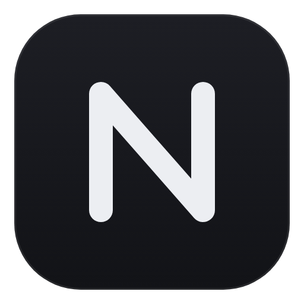
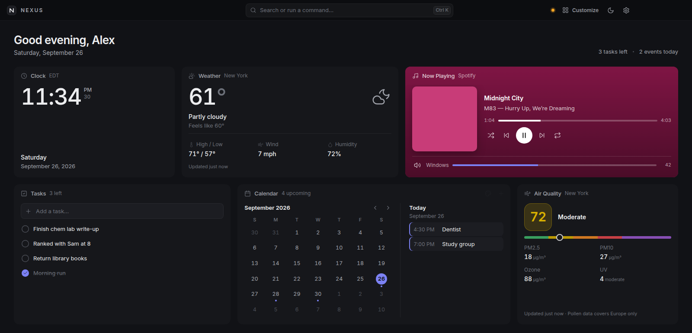

  

<h1 align="center">NEXUS</h1>

<b>A calm, fast personal dashboard for Windows.</b> 
Everything you check every day — in one place, on your PC, with no accounts and no tracking.

  <a href="https://github.com/avisuifd/nexus/releases/latest"><b>⬇ Download for Windows</b></a> ·
  <a href="PRIVACY.md">Privacy</a> ·
  <a href="TERMS.md">Terms</a> ·
  <a href="https://github.com/avisuifd/nexus/issues">Report a bug</a>

## What's inside

**Your day**
- Tasks, notes, calendar (month, week, agenda or a "today" page), countdowns, quick links
- Clocks (digital or analog, big or small), world clocks, timers, stopwatch, Pomodoro focus timer
- Scratch calculator — type math line by line, with variables and percentages

**Live info**
- Weather, 7-day forecast, air quality, and official severe-weather alerts (US)
- Stocks and crypto watchlist, sports scores for your teams

**Your PC**
- **Now Playing** — whatever's playing (Spotify, YouTube, anything) with album art, seek, and volume sliders for Windows and the app
- **Text shortcuts** — type `;email` in any app and it expands to your text
- Tiny dots in the title bar when an app uses your **camera or microphone**
- Clipboard history, system stats, and a screensaver with a big clock

**With friends**
- **Chat** — private, end-to-end encrypted messages, photos and files. No accounts: share an invite code.
- **Mini games** inside Chat: Tic-tac-toe, Connect 4 and Chess (full rules)
- **Phone Drop** — scan a QR code to send photos and files between your phone and PC

**Gaming**
- **Rocket League live stats** — score, boost, goals, saves and your session record, using the game's official Stats API (no injection, Easy Anti-Cheat safe)

Plus: drag-and-drop layout, dark and light themes, accent colors, a command palette (`Ctrl K`), global hotkey (`Ctrl Shift Space`), tray icon, and automatic updates.

## Install

1. Download **NEXUS-Setup-x.y.z.exe** from the [latest release](https://github.com/avisuifd/nexus/releases/latest).
2. Run it. Windows may show **"Windows protected your PC"** because NEXUS is new and not code-signed yet — click **More info → Run anyway**.
3. Accept the license, pick where to install, done. NEXUS updates itself from then on.

Requires Windows 10 or 11 (64-bit).

**Checking the download:** each release lists the installer's SHA-256 hash. In PowerShell: `Get-FileHash .\NEXUS-Setup-1.6.0.exe` and compare. You can also scan it at virustotal.com.

## Privacy, in one paragraph

Your data stays on your PC. NEXUS has **no accounts, no ads, no tracking and no analytics**, and there's no NEXUS server. Features that need the internet send only what they need — your weather city's coordinates to Open-Meteo, your stock symbols to Yahoo, and so on. Chat and Phone Drop's Internet mode are **end-to-end encrypted** and pass through the free ntfy.sh relay, which can't read them. Full details: [Privacy Policy](PRIVACY.md).

## FAQ

**Is it free?** Yes, completely.
**Is it open source?** No — it's free to use, but the code isn't open. See the [License](LICENSE.md).
**Mac or Linux?** Windows only for now.
**Does the Rocket League widget show MMR?** No — the official Stats API doesn't provide it, and NEXUS doesn't hook into the game.
**Why does Windows warn me?** New apps without a paid code-signing certificate get a SmartScreen warning until enough people have installed them.

## Legal

[License](LICENSE.md) · [Terms of Use](TERMS.md) · [Privacy Policy](PRIVACY.md) · [Third-party notices](THIRD-PARTY-NOTICES.md)

NEXUS is an independent project and is not affiliated with Psyonix, Epic Games, Spotify, Google, Apple, Microsoft, ESPN or Yahoo. Copyright © 2026 avisuifd. All rights reserved.
